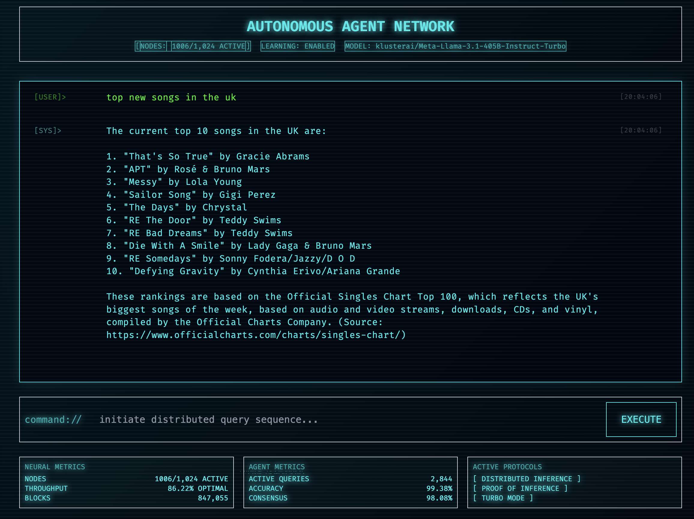

# cyberpunk researcher 



## features

- autonomous mode for research that can search and read websites
- real-time communication via websocket
- cool cyberpunk ui

## prerequisites

- python 3.8+ (python 3.13 has issues with multiprocessing - use 3.8-3.11 for best compatibility)
- access to an llm api endpoint like kluster.ai

## setup

2. create and activate a virtual environment:
```bash
python -m venv .venv
source .venv/bin/activate  
```

3. install dependencies:
```bash
pip install -r requirements.txt
```

4. create a `.env` file in the project root:
```env
llm_base_url=your_llm_api_endpoint
llm_api_key=your_api_key
host=0.0.0.0
port=8000
debug=false
```

5. run the application:

for development (with auto-reload):
```bash
python -m src.backend.api.app
```

for production:
```bash
# single worker mode (most stable)
uvicorn src.backend.api.app:app --host 0.0.0.0 --port 8000

# multi-worker mode (if using python <3.12)
uvicorn src.backend.api.app:app --workers 4 --host 0.0.0.0 --port 8000
```

note: if using python 3.13+, stick to single worker mode due to multiprocessing limitations.

the application will be available at `http://localhost:8000`

## development

### frontend

the frontend is built with:
- tailwindcss for styling
- marked.js for markdown rendering
- websocket for real-time communication

to modify the frontend:
1. edit files in `src/frontend/`
2. the changes will be reflected immediately (no build step required)

### backend

the backend uses:
- fastapi for the web framework
- langgraph for llm interaction
- duckduckgo for web searches
- beautifulsoup for web scraping

to modify the backend:
1. edit files in `src/backend/`
2. the server will auto-reload on changes when running in debug mode

## configuration

all configuration is handled through environment variables:

- `llm_base_url`: base url for the llm api endpoint
- `llm_api_key`: api key for llm access
- `host`: host to bind the server to
- `port`: port to run the server on
- `debug`: enable debug mode
